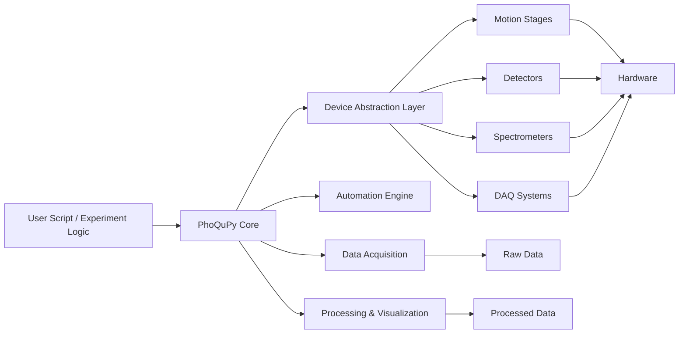
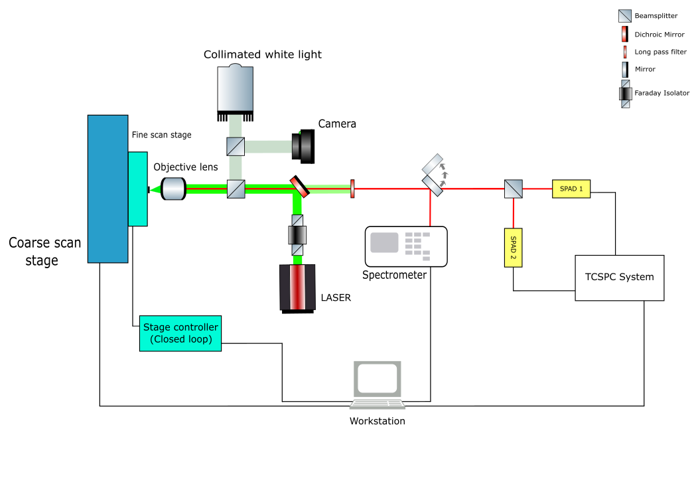
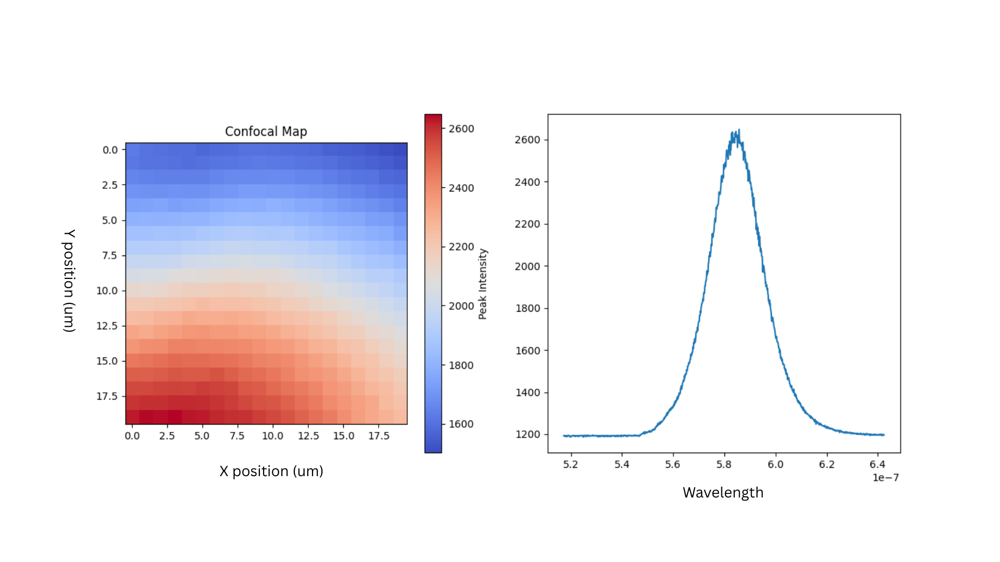
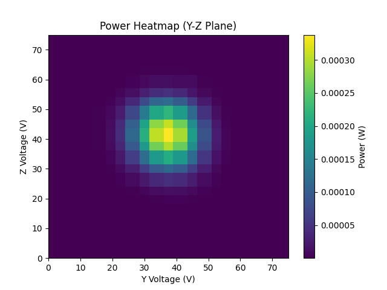
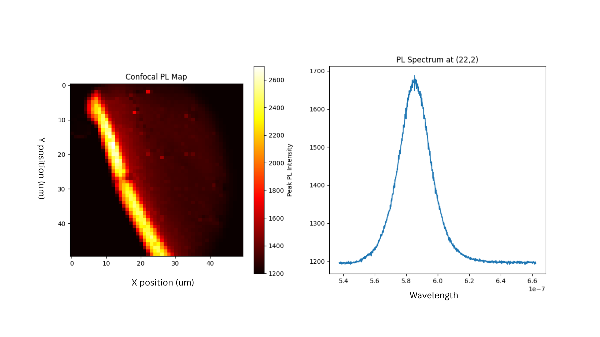
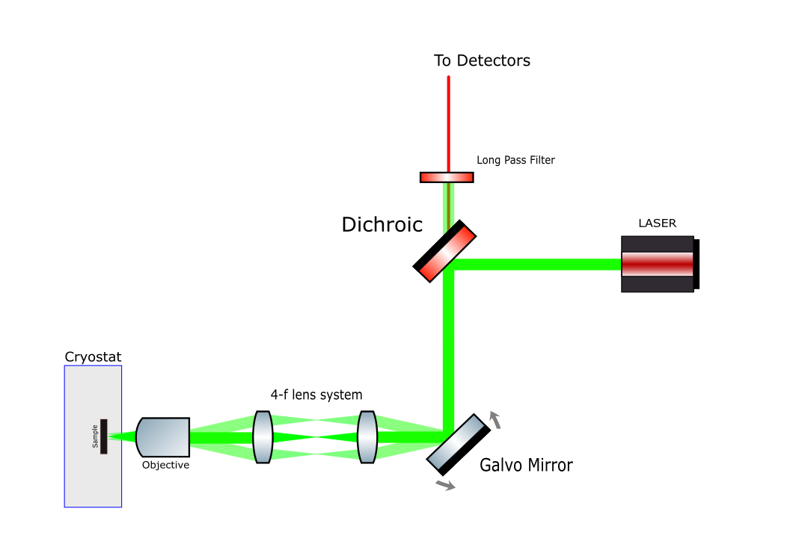
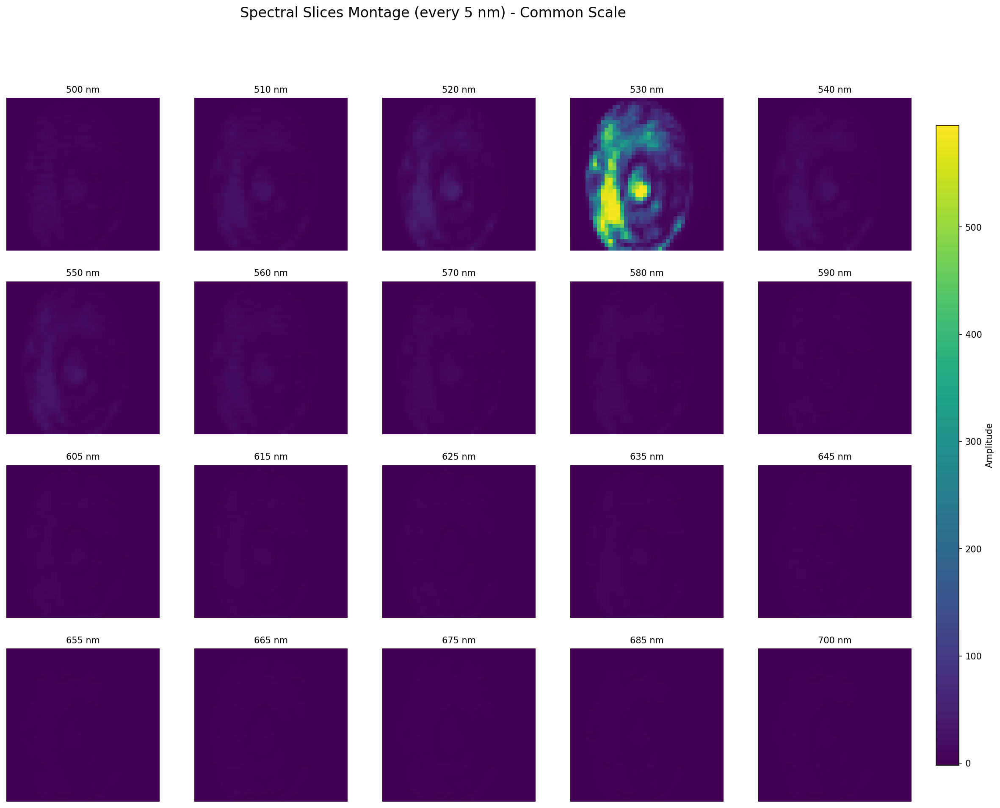

# ⚡ PhoQuPy

### *Automation-first framework for quantum optics experiments*

> 🔬 Used in active quantum optics experiments at IIT Bombay
> 
> Control your experiment. Not just your equations.

---

[](https://arxiv.org/abs/2602.04505)
[](https://doi.org/10.5281/zenodo.xxxxxx)

---

## 🚀 What is PhoQuPy?

**PhoQuPy is a Python framework for automating quantum optics experiments.**

It connects:

* motion stages
* spectrometers
* detectors (SPADs, EMCCDs, etc.)
* interferometers
* data acquisition pipelines

into a **single programmable workflow**.

---

## 🧠 Why this exists

Quantum optics experiments are:

* repetitive
* timing-sensitive
* hardware-fragmented
* difficult to reproduce

Manual operation doesn’t scale.

PhoQuPy enables:

* fully automated measurement pipelines
* synchronized multi-device control
* reproducible experimental protocols

---

## ⚡ Core Idea

> Treat experiments like programs.

Instead of:

```
turn knob → wait → click → save → repeat
```

You write:

```python
scan = RasterScan(x_range, y_range, resolution=200)

for point in scan:
    move_stage(point)
    spectrum = acquire_spectrum()
    save(spectrum)
```

---

## 🧩 Architecture



---

## 🎥 Automated Scan Demo


---

## 🧪 From Manual → Automated Experiments

### ❌ Manual Workflow

* Align optics manually
* Move stage → measure → save → repeat
* Copy-paste scripts
* High chance of human error
* Poor reproducibility

---

### ✅ PhoQuPy Workflow

```python
scan = ConfocalScan(x_range=(0, 50), y_range=(0, 50), step=0.5)
data = scan.run()
scan.plot_map(data)
```

---

### ⚡ Result

|                 | Manual | PhoQuPy   |
| --------------- | ------ | --------- |
| Speed           | Slow   | Fast      |
| Reproducibility | Low    | High      |
| Scalability     | Poor   | Excellent |
| Human error     | High   | Minimal   |
| Automation      | ❌      | ✅         |

---

## 🔬 Used in Real Experiments

PhoQuPy is actively used in the **Laboratory of Optics of Quantum Materials (LOQM), IIT Bombay**.

Note: Parts of this repo cannot be used directly in another facility, as various configuration files, DLLs, and other non-public support files have not been included. 

---

### 🧠 System Architecture



---

### 🔴 Confocal Photoluminescence Mapping



* Automated raster scanning of quantum emitters
* Real-time PL map generation

---

### 🟡 Fiber Alignment Scan



* Automated alignment optimization
* Gaussian peak detection

---

### 🔵 Cryogenic PL Mapping (Galvo)




* High-speed scanning
* Cryostat-compatible workflows

---

### 🟣 Hyperspectral Imaging



* Full spectral cube acquisition
* Wavelength-resolved imaging

---

### ⚡ What this demonstrates

* Multi-instrument synchronization
* Fully automated pipelines
* Real-time visualization
* High-throughput measurements

---

## 🧰 Supported Hardware (Extensible)

| Category           | Supported Devices                   |
| ------------------ | ----------------------------------- |
| Motion Stages      | Thorlabs, Newport                   |
| Detectors          | SPADs, APDs                         |
| Cameras            | EMCCD (Andor), sCMOS                |
| Spectrometers      | Princeton Instruments, Ocean Optics |
| Timing Electronics | TCSPC modules                       |
| DAQ                | NI DAQ                              |

---

## 📦 Installation

```bash
pip install phoqupy
```

or

```bash
git clone https://github.com/loqm/phoqupy
cd phoqupy
pip install -e .
```

---

## 📚 Documentation

👉 https://loqm.github.io/phoqupy

Includes:

* Getting Started
* Example Experiments
* Hardware Integration
* API Reference

---

## 📄 Use in a Paper

If you use PhoQuPy in your research, please cite:

>  S. Murali, A. Kumar, *PhoQuPy: A Python Framework for Automating Quantum Optics Experiments*, arXiv:2602.04505 (2026)

### BibTeX

```bibtex
@article{phoqupy2026,
  title   = {PhoQuPy: A Python Framework for Automating Quantum Optics Experiments},
  author  = {Murali, Srivatsa and Kumar, Anshuman},
  year    = {2026},
  journal = {arXiv preprint},
  eprint  = {2602.04505},
  archivePrefix = {arXiv},
  primaryClass  = {quant-ph}
}
```

---

## 🤝 Contributing

If you have ever:

* struggled to integrate lab hardware
* rewritten experiment scripts
* lost reproducibility

You should contribute.

---

## 👤 Authors

**Srivatsa Murali**

**Anshuman Kumar**

Laboratory of Optics of Quantum Materials (LOQM)

IIT Bombay

---

## 🌌 Vision

To make **quantum optics experiments programmable, scalable, and reproducible.**

